# Jenkins 설치 및 Terraform 연동 방법

### 배포 권한 부여 
1. Ec2 Role
 - AWS sts, DynamoDB(Lock table), S3(State file) 권한만 존재하는 최소 권한으루 부여할 것. 
 - `arn:aws:iam::333003622053:role/mzc_solutions_architect` 처럼 assume으로 구성하고 Condition에는 EC2 Role만 포함할것 


### Jenkins 구성 
 - 기타 내용은 스크립트 참조할 것

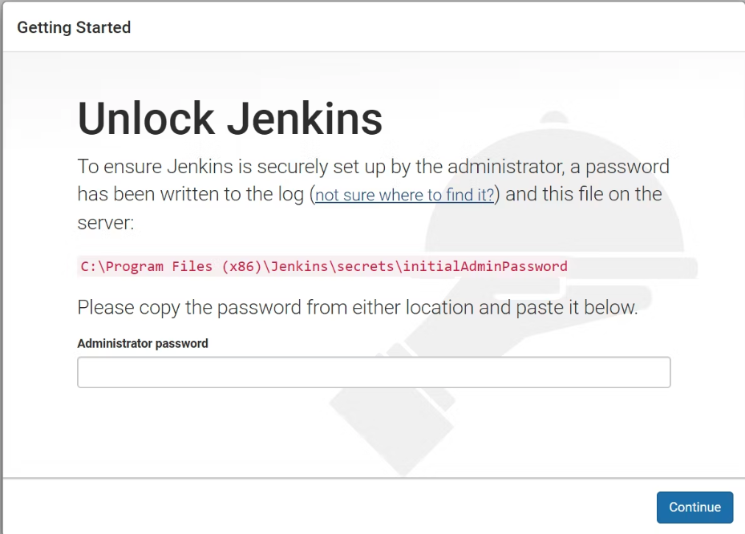
### Jenkins 초기 패스워드 확인
#### [root@ip-172-31-10-222 ~]# docker exec -it 7580a647e862 /bin/bash  # Jenkins container 내부로 접근 
#### jenkins@7580a647e862:/$ cat /var/jenkins_home/secrets/initialAdminPassword  # 패스워드 확인
```bash
55c7cbf29a30459aa075d3dbd20a33ab
```


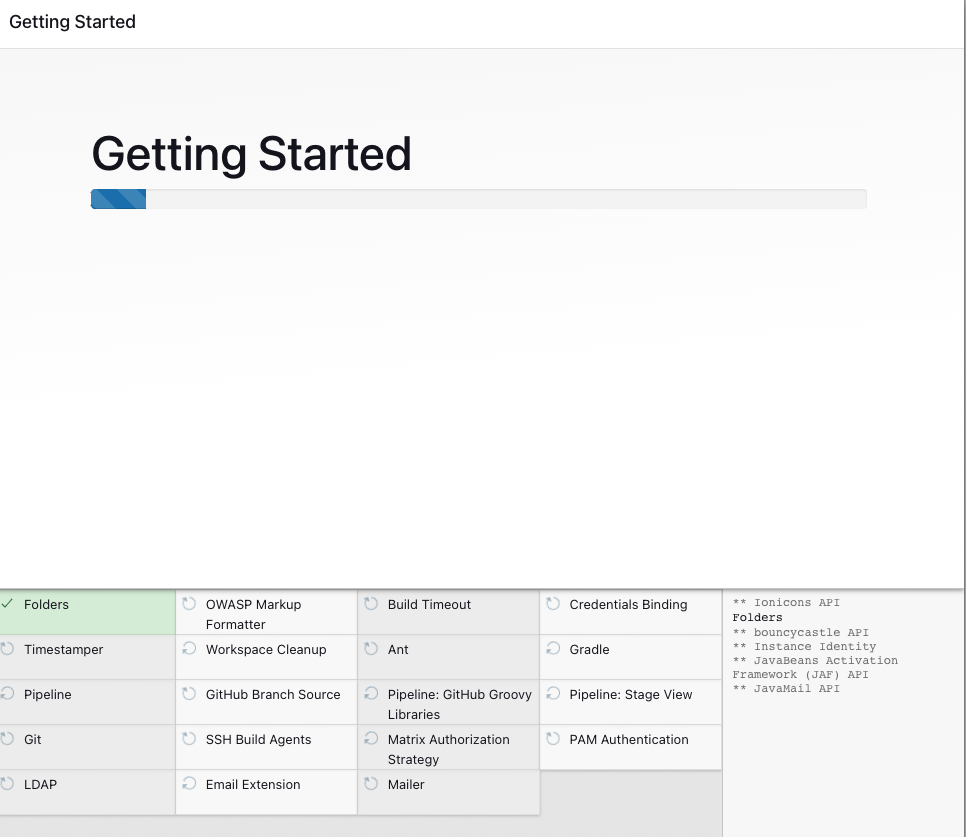
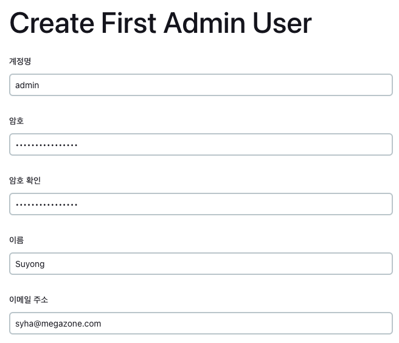
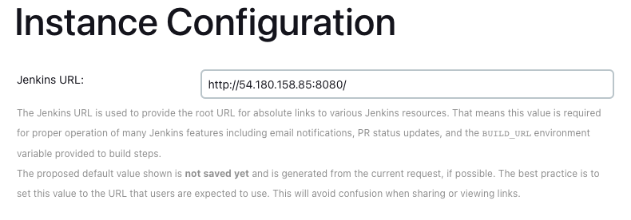
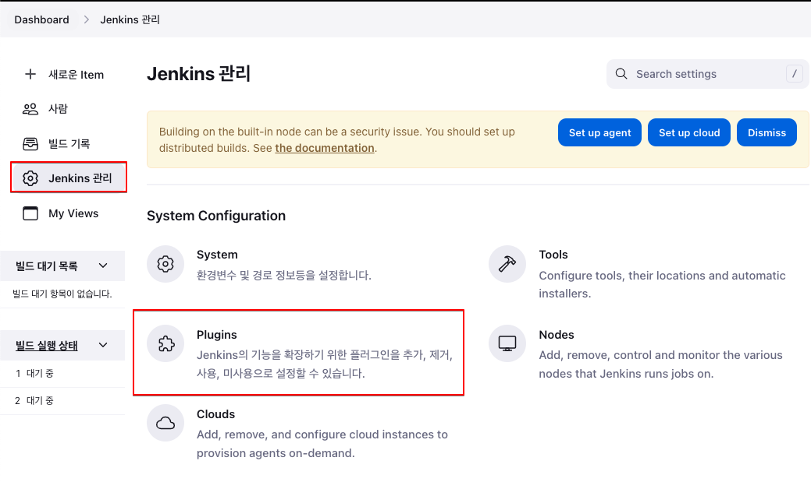
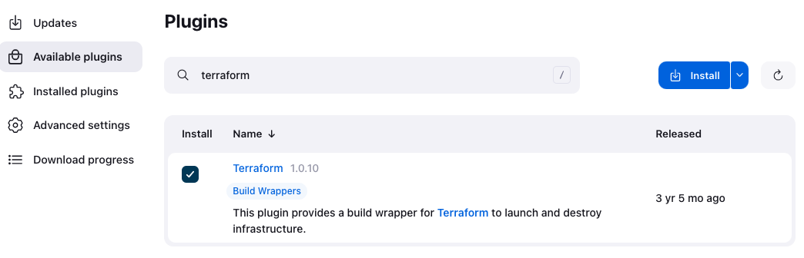
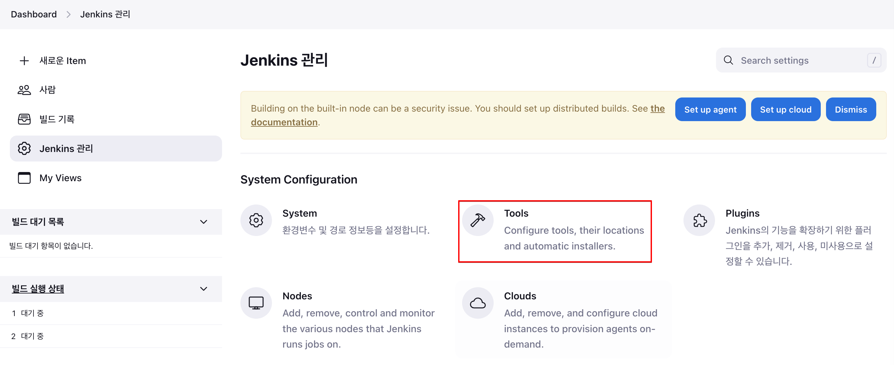
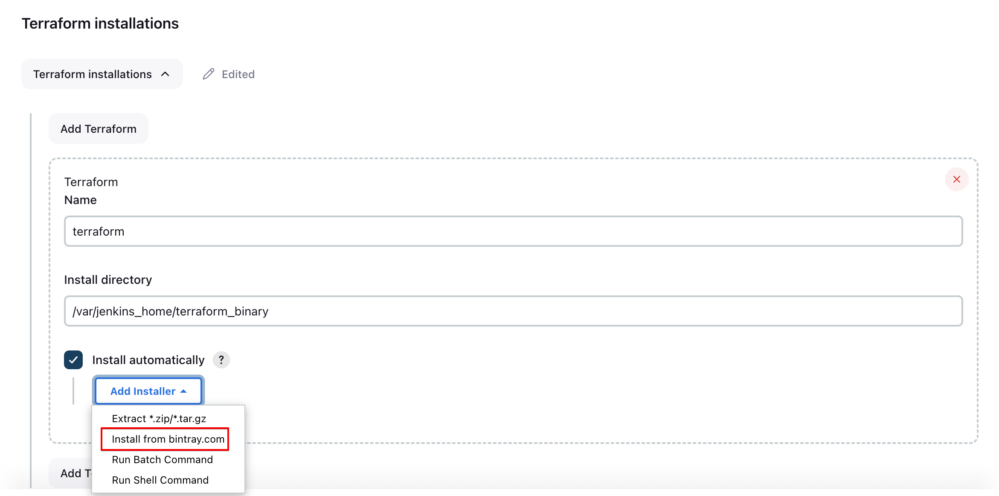
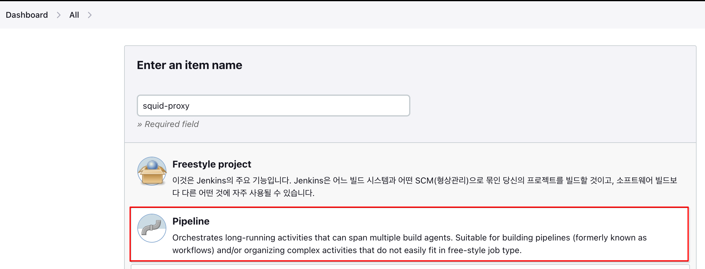
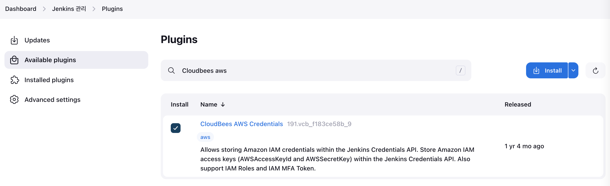
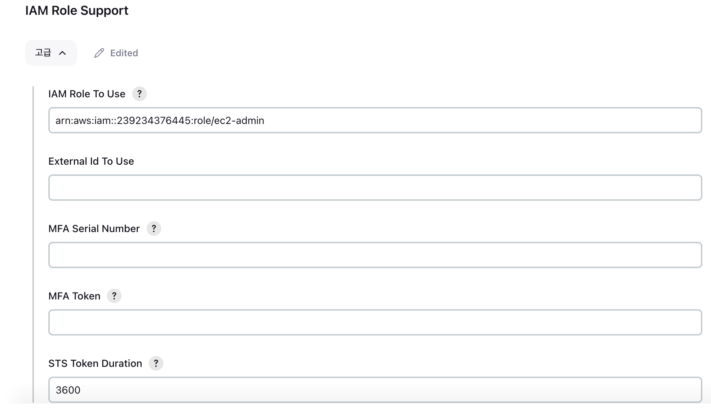


6-7 사이 
plugin 설치하면 재기동되는데 이때 컨테이너가 중지됨


/var/jenkins_home/terraform_binary/terraform


```bash
pipeline {
    agent any
    
    environment {
        TF_WORKSPACE = 'prod'
    }
    parameters {
        choice(
            choices: ['plan', 'apply', 'show', 'preview-destroy', 'destroy'],
            description: 'Terraform action to apply',
            name: 'action')
        choice(
            choices: ['prod', 'net'],
            description: 'deployment environment at terraform workspaces',
            name: 'ENVIRONMENT')
    }
    
    stages {
        stage('Checkout') {
            steps {
                // 참고 URL: https://plugins.jenkins.io/git/
                // credential이 있으면 위 링크보고 설정
                checkout scmGit(
                    branches: [[name: 'master']],
                    userRemoteConfigs: [[url: 'https://github.com/blueice123/squid-proxy.git']])
            }
        }
        stage ('terraform init') { 
            steps {
                sh ('/var/jenkins_home/terraform_binary/terraform version')
                sh ('/var/jenkins_home/terraform_binary/terraform init -upgrade')
                // sh ('/var/jenkins_home/terraform_binary/terraform workspace new ${TF_WORKSPACE}' || true)
                // sh ('/var/jenkins_home/terraform_binary/terraform workspace seclect ${TF_WORKSPACE}')
                sh ('/var/jenkins_home/terraform_binary/terraform workspace list')
            }
        }
        stage ('terraform syntax validate') {
            steps {
                sh ('/var/jenkins_home/terraform_binary/terraform validate -no-color')
            }
        }
        stage ('terraform plan') {
            when {
                expression { params.action == 'plan' || params.action == 'apply' }
            }
            steps {
                sh ('/var/jenkins_home/terraform_binary/terraform -no-color -input=false -output-tfplan')
            }
        }
        stage('Approval') {
            when {
                expression { params.action == 'apply'}
            }
            steps {
                script {
                    sh ('/var/jenkins_home/terraform_binary/terraform show -no-color tfplan > tfplan.txt')
                    def plan = readFile 'tfplan.txt'
                    input message: "Apply the plan?",
                    parameters: [text(name: 'Plan', description: 'Please review the plan', defaultValue: plan)]
                }
             }
        }
        stage ('terraform apply') {
            when {
                expression { params.action == 'apply' }
            }
            steps {
                sh ('/var/jenkins_home/terraform_binary/terraform apply -no-color -input=false tfplan')
            }
        }
        stage('show') {
            when {
                expression { params.action == 'show' }
            }
            steps {
                sh '/var/jenkins_home/terraform_binary/terraform show -no-color'
            }
        }
        stage('preview-destroy') {
            when {
                expression { params.action == 'preview-destroy' || params.action == 'destroy'}
            }
            steps {
                sh '/var/jenkins_home/terraform_binary/terraform plan -no-color -destroy -out=tfplan'
                sh '/var/jenkins_home/terraform_binary/terraform show -no-color tfplan > tfplan.txt'
            }
        }
        stage('destroy') {
            when {
                expression { params.action == 'destroy' }
            }
            steps {
                script {
                    def plan = readFile 'tfplan.txt'
                    input message: "Delete the stack?",
                    parameters: [text(name: 'Plan', description: 'Please review the plan', defaultValue: plan)]
                }
                sh '/var/jenkins_home/terraform_binary/terraform destroy -auto-approve'
            }
        }
    }
}
```

https://spacelift.io/blog/terraform-jenkins